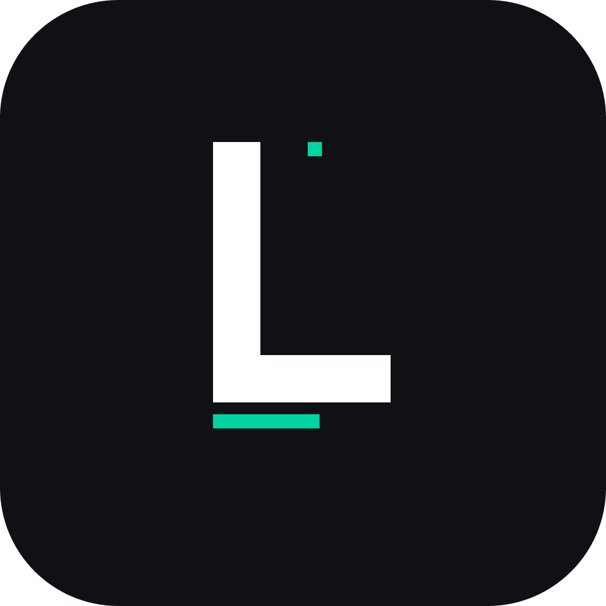

# Logary

  

  <strong>Your Ultimate Gaming Odyssey Starts Here.</strong>

  <a href="https://logary.app">Website</a> •
  <a href="#-features">Features</a> •
  <a href="#-community">Community</a> •
  <a href="#-support">Support</a>

---

### About Logary
Logary is a modern, high-performance platform designed for gamers who want to document their journey. Beyond just a game tracker, Logary is a digital identity where you can showcase your achievements, manage your backlog, and connect with fellow gamers.

Whether you're finishing an indie gem or conquering an AAA title, Logary is there to log every moment.

### Key Features
- **Smart Game Logging:** Track hours, platforms, and completion status with a sleek UI.
- **Gaming Identity:** A personalized profile showcasing your "Games of the Year" and all-time favorites.
- **Cross-Platform Support:** Seamless experience across Web and Mobile (React Native).
- **Social Integration:** Copy your platform usernames (Steam, Xbox, PSN) with a single click.
- **Premium Experience:** Ad-free, exclusive badges, and early access for PRO members.

---

### Join Our Community
Get the latest updates, report bugs, or just chat with the team!

---

### Support the Journey
Logary is being built with passion by a dedicated team. Your support helps us keep the servers running and the updates rolling!

---

### Tech Stack
- **Frontend:** Next.js (App Router), Tailwind CSS, Framer Motion
- **Mobile:** React Native, Expo
- **Backend:** (Sizin kullandığınız backend teknolojisi örn: Firebase / Supabase)
- **Deployment:** Vercel

---

### License
Copyright (c) 2026 Logary. All rights reserved. 
This project is proprietary. See the [LICENSE](LICENSE) file for more details.

---

  Made with by the Logary Team

